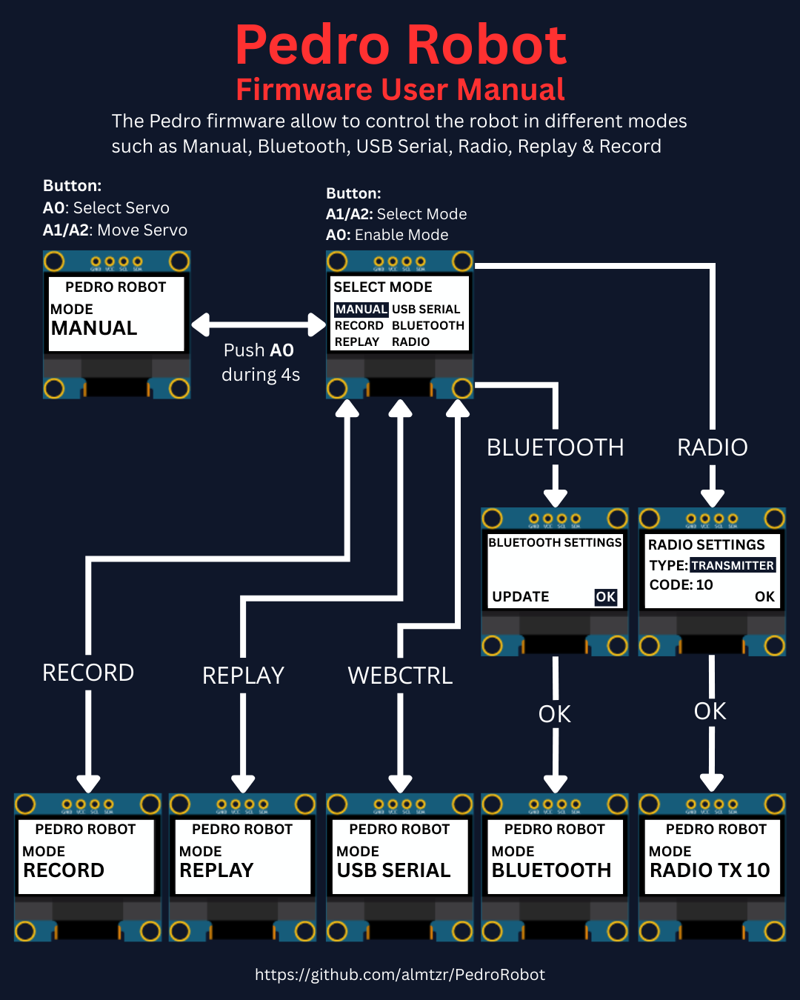
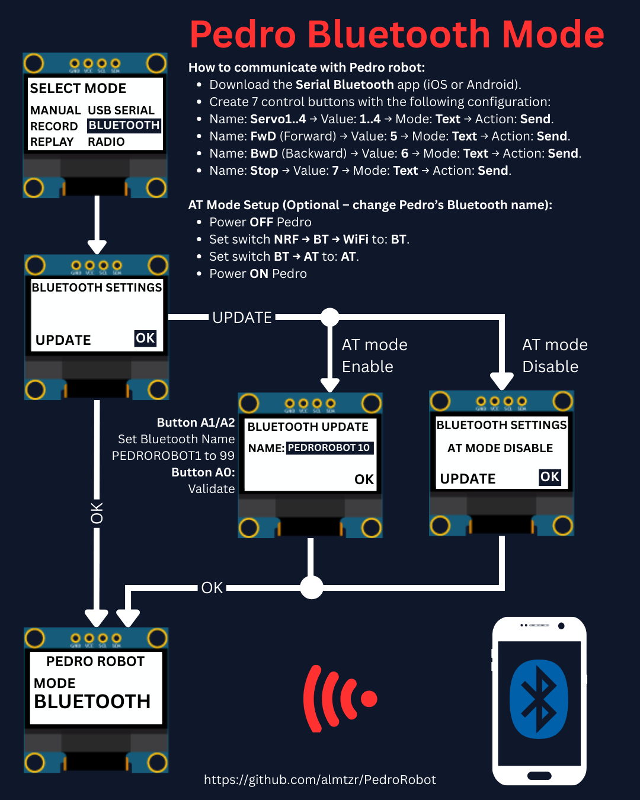
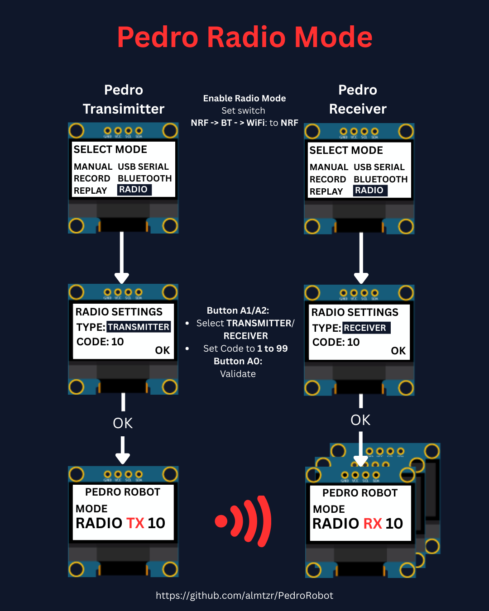
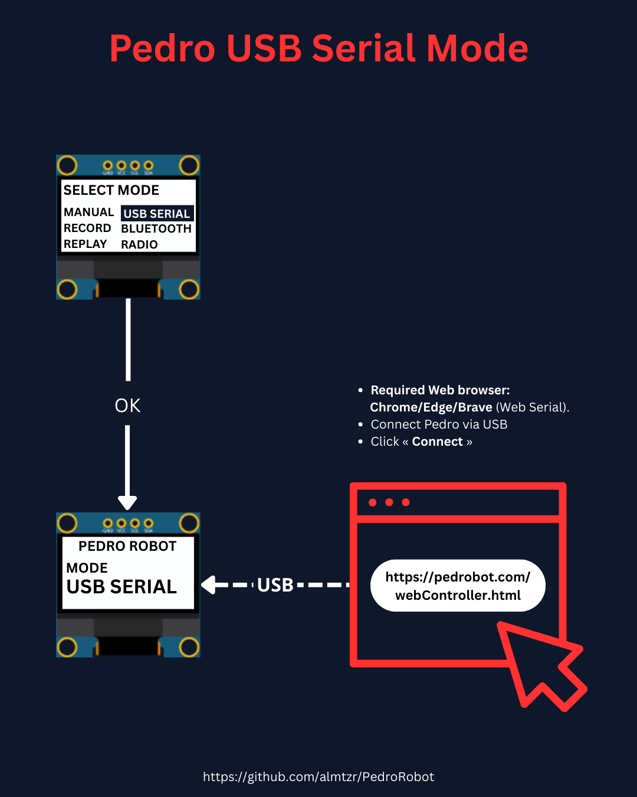

# 📂 Pedro Robot

Source code and library to program and control the Pedro robot.
Available Control modes : **Manual**, **Record & Replay**, **Bluetooth**, **Radio**, and **USB Serial**.

## 🖥️ Setup

1. Install the latest Arduino IDE from [arduino.cc](https://www.arduino.cc/en/software).
2. In Arduino IDE install **PedroRobot** library: Sketch → Include Library → Manage Libraries → search **PedroRobot** → Install.
3. Install required dependencies:
   * **U8glib**: Sketch → Include Library → Manage Libraries → search **U8glib** → Install.
   * **RF24**: Sketch → Include Library → Manage Libraries → search **RF24** → Install.
4. Select your board: Tools → Board → Arduino Micro and the correct port.
5. Open the example: File → Examples → PedroRobot → PedroRobot.
6. Compile and upload to the board.

> **Note:** Make sure all dependencies are installed before compiling to avoid errors.

## ✨ Pedro Modes

    
    

    
    

## 🎮 1. Manual Mode

**What it does:** Direct control of servo motors using onboard buttons.

**How to use:**

1. Power **ON** Pedro (default mode **Manual**)
2. Use button **A0** to Select Servo.
3. Use button **A1** to Move Servo to Left.
4. Use button **A2** to Move Servo to Right.

🎓 **STEM Insight:** Learn about servo motors and direct PWM control.

## 🎥 2. Record & Replay Mode

**What it does:** Record servo movements, then replay them.

**How to use:**

1. Enter the **Select Mode** menu (hold button **A0** for 4 seconds).
2. Choose **Record Mode** from the menu.
3. Press **A0** to confirm.
4. Move Pedro manually using the buttons (as in **Manual Mode**).
5. Re-enter the **Select Mode** menu (hold **A0** for 4 seconds).
6. Select **Replay Mode**.
7. Pedro will now repeat the recorded sequence in a loop.
8. To stop or change, re-enter the **Select Mode** menu.

🎓 **STEM Insight:** Teaches concepts of timing, sequencing, and automation.

## 📶 3. Bluetooth Mode (HC-05)

**What it does:** Control Pedro via smartphone or PC.

**How to use:**

1. Download the **Serial Bluetooth** app (iOS or Android).
2. Create 7 control buttons with the following configuration:
* Name: **Servo1** → Value: **1** → Mode: **Text** → Action: **Send**.
* Name: **Servo2** → Value: **2** → Mode: **Text** → Action: **Send**.
* Name: **Servo3** → Value: **3** → Mode: **Text** → Action: **Send**.
* Name: **Servo4** → Value: **4** → Mode: **Text** → Action: **Send**.
* Name: **FwD** (Forward) → Value: **5** → Mode: **Text** → Action: **Send**.
* Name: **BwD** (Backward) → Value: **6** → Mode: **Text** → Action: **Send**.
* Name: **Stop** → Value: **7** → Mode: **Text** → Action: **Send**.
3. On Pedro, set the switch **AT → BT** to: **BT**.
4. Pair your device with Pedro’s HC-05 module (default name: HC-05, PIN: 1234).
5. Use the app buttons to send commands and control Pedro in real time.

🛠️ **AT Mode Setup (Optional – change Pedro’s Bluetooth name):**

1. Power **OFF** Pedro.
2. Set switch **NRF → BT → WiFi** to: **BT**.
3. Set switch **BT → AT** to: **AT**.
4. Power **ON** Pedro.
5. Enter the **BLUETOOTH UPDATE** menu.
6. Change Pedro’s Bluetooth name (e.g., from PEDROROBOT1 up to PEDROROBOT99).
7. Pair your device with the new name (PEDROROBOTX).
8. Use the app buttons to control Pedro as before.

🎓 **STEM Insight:** : Students learn about wireless serial communication and how to configure Bluetooth modules for embedded systems.

## 📡 4. Radio Mode (NRF24L01)

**What it does:** Enables remote communication between two Pedro robots or more using the NRF24L01 radio module.

**How to use:**

1. Insert the **NRF24L01 module** into the left slot of each Pedro board (one robot as transmitter, the other as receiver).
2. Set Pedro’s switch **NRF → BT → WiFi** to: **NRF**.
3. Enter the **Select Mode** menu (hold button **A0** for 4 seconds).
4. Choose **Radio Mode** from the menu.
5. Press **A0** to confirm.
6. Define the robot’s role (type): press **A1** to select **TRANSMITTER** or **RECEIVER**.
7. Press **A0** to confirm the role.
8. Set a communication Code Key:
* Press **A1** to increase (increment).
* Press **A2** to decrease (decrement).
* Values range from 1 to 99.
9. Press **A0** to confirm the Code Key.
10. Press **A0** again to validate (OK).

> **Note:** Both the transmitter and receiver must use the same Code Key to establish communication. 

🎓 **STEM Insight:** This mode introduces students to the basics of **radio frequency communication**, addressing concepts like **transmitter/receiver** pairing and unique channel codes.

## 🌐 5. USB Serial Mode

**What it does:** Control Pedro from your PC with Pedro-IHM.

**How to use:**

1. Enter the **Select Mode** menu (hold button **A0** for 4 seconds).
2. Choose **USB SERIAL MODE** from the menu.
3. Press **A0** to confirm.
4. Connect Pedro via USB cable.
5. Launch the [web controller](https://www.pedrobot.com/webController.html) app.
6. Send commands & test servo response.

🎓 **STEM Insight:** Embedded programming and PC-robot communication.

